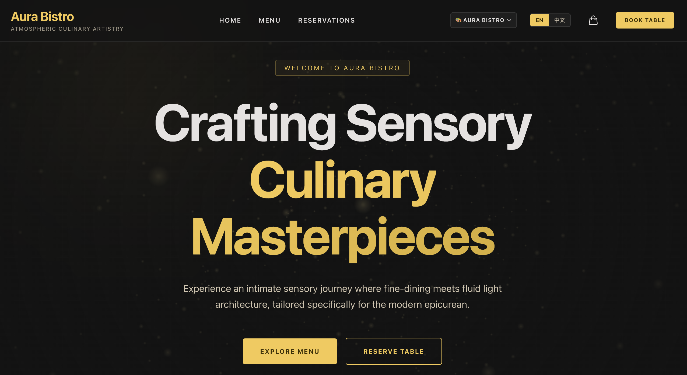

# Aura Bistro — Restaurant Portal

**Aura Bistro** is a premium, edge-native digital portal designed for modern upscale restaurants. Built with a focus on "Atmospheric Culinary Artistry," the platform offers an immersive user experience, real-time interactivity, and a robust administrative backend—all optimized for global edge distribution with zero cold starts.

## Features

- **Immersive Visual Design**: Utilizes a Noir & Gold theme, fluid typography, smooth CSS layouts, and GPU-accelerated interactive elements.
- **Dynamic 3D Atmosphere**: Features a responsive, visibility-aware 3D wireframe background powered by Three.js that dynamically scales performance (and automatically falls back to an elegant CSS gradient when reduced motion is preferred).
- **Edge-Optimized Performance**: Developed with a hybrid SSG + ISR + CSR rendering strategy using Next.js 15 and React 19 to achieve sub-second LCP (Largest Contentful Paint) and zero-second TTFB (Time to First Byte).
- **Zustand-Powered Cart & Ordering**: Zero-re-render cart operations with optimistic UI updates and background edge API synchronization (sub-16ms interactive response guaranteed).
- **Table Reservations**: An intuitive booking flow featuring interactive guest counters, custom date picker styling, and time-slot chips.
- **Edge-Native Admin Portal**: A backoffice console enabling restaurant operators to manage seasonal menus (D1 database with R2 bucket for images), track real-time orders via a Kanban board, and manage table reservations with edge-native authentication (Cloudflare Access or Middleware+JWT).
- **Chameleon Theme Engine**: A multi-tenant custom visual identity system permitting rapid brand adaptation (presets like Noir Gold, Emerald Copper, and Burgundy Rose) with zero runtime performance cost.

## Technology Stack

- **Framework**: Next.js 15+ (React 19) utilizing App Router and hybrid rendering.
- **Styling & Animations**: Tailwind CSS v4, Framer Motion (GPU accelerated), and Three.js (for immersive 3D effects).
- **State Management**: Zustand with persistent storage.
- **Infrastructure**: Cloudflare Pages, Workers, Workers KV (caching layer), D1 (edge SQLite database), and R2 (object storage for images).
