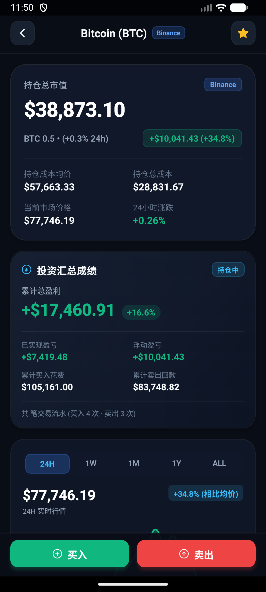
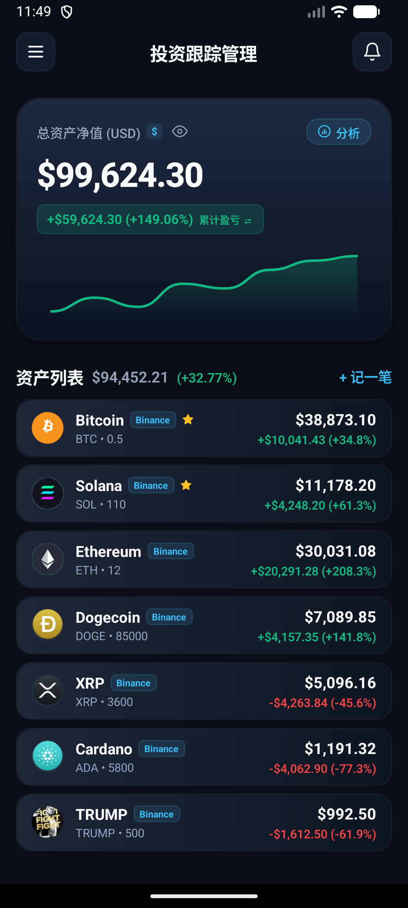
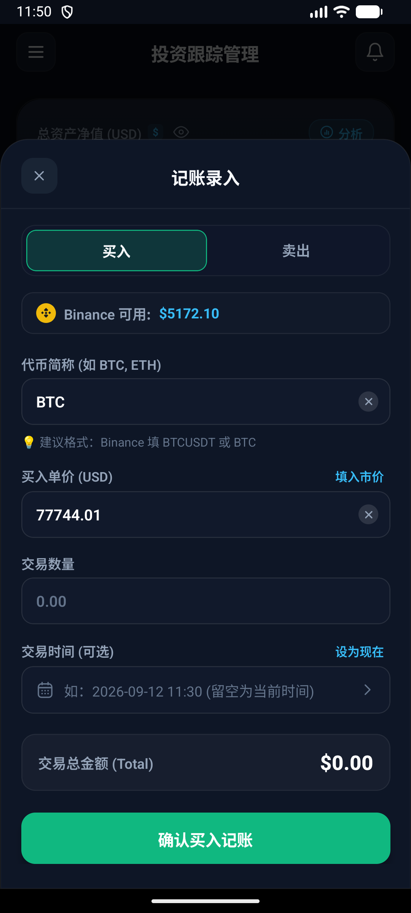
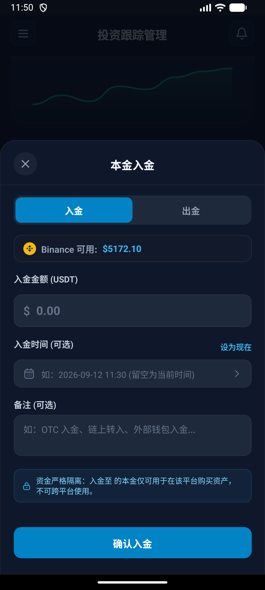
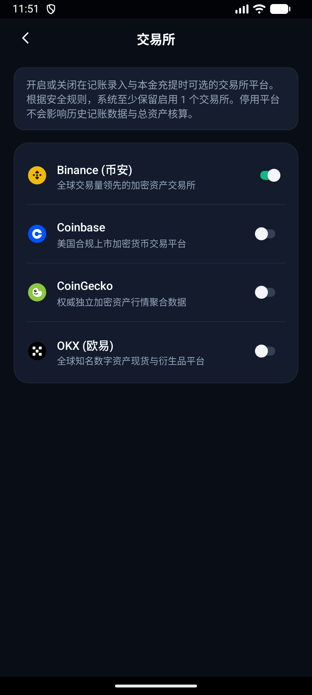

# Investment Tracker

  <b>A Local-First, Privacy-Centric Multi-Exchange Portfolio & Capital Silo Tracking App</b>

---

---

## 📖 Overview

**Investment Tracker** is a modern, minimalist, high signal-to-noise ratio personal asset management application built specifically for cryptocurrency investors (with seamless extensibility to traditional equities).

Unlike centralized portfolio trackers that upload sensitive financial data to the cloud, or lightweight apps that detach from real-world trading dynamics by allowing out-of-thin-air trades, Investment Tracker embraces the **"Exchange Aggregator"** and **"Local Capital Silo"** principles:

- **100% Data Sovereignty**: Powered by local SQLite storage with zero server-side sync. Your portfolio data never leaves your device.
- **Realistic Capital Discipline**: Enforces **Deposit-First Trading**. Exchange balances (Binance, OKX, Coinbase, etc.) are strictly siloed. Purchases deduct from your available stablecoin deposits on that specific platform, while sell proceeds automatically flow back into the platform's cash reserve.
- **Institutional-Grade PnL Engine**: Weighted-average cost basis accounting that rigorously segregates Unrealized PnL from Realized PnL with precision calculations.