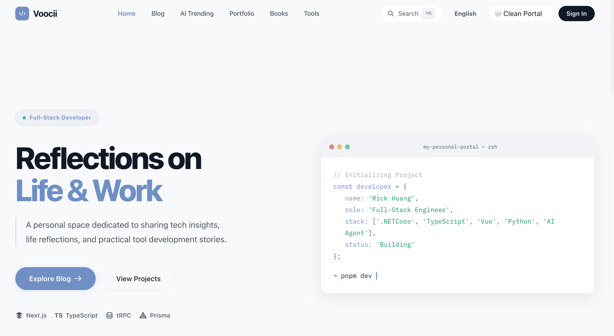

# Personal Portal

A modern, full-stack personal portal and portfolio built with Next.js 16, tRPC, Prisma, and Tailwind CSS v4.

## Features

- **Next.js 16 App Router**: Leverage the latest React features and server components.
- **tRPC**: End-to-end typesafe APIs.
- **Prisma ORM**: Type-safe database access with PostgreSQL.
- **Tailwind CSS v4**: Utility-first styling with a modern design system.
- **Next-Intl**: Full internationalization (i18n) support for English and Chinese.
- **Theme Engine**: Built-in dark mode and multiple theme presets.
- **Monorepo Architecture**: Managed with Turborepo and pnpm workspaces.
- **Modular Design**: Includes Blog, Portfolio, Guestbook, Links, and developer Tools.
- **Admin Dashboard**: Integrated content management and analytics.
